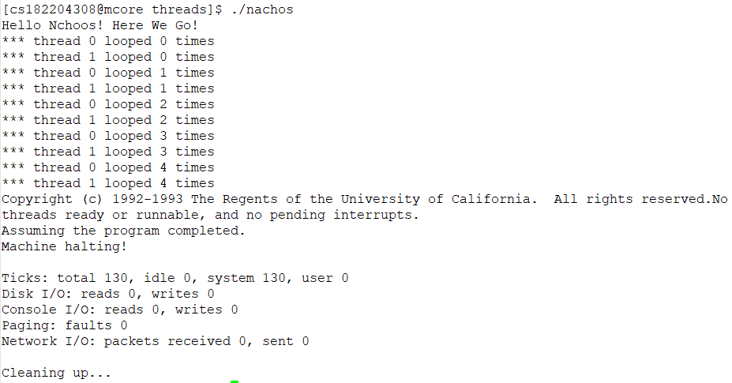

## 1 安装并编译Nachos
### 1.1 编译Nachos源代码
下载 “nachos-linux64.tar.gz" 并拷贝到实验平台的个人目录下；通过命令 "tar -zxf nachos-linux64.tar.gz"  解压源代码；进入"nachos-3.4/code" 目录，执行命令"make" ；进入"nachos-3.4/code/threads" 目录，执行 "./nachos" 并获得以下结果：

### 1.2 main.cc源码分析
进入main函数后循环判断传入的参数，默认testnum=1，而后运行测试线程。
首先我们创建一个线程（线程号为0），调用该线程的Fork方法，新线程（线程号为1）调用SimpleThread方法，然后主线程调用SimpleThread方法。
在SimpleThread方法中，每个线程需要循环执行五次打印操作，每执行一次打印，当前线程就执行 Yield() 方法，让另一个线程执行，来回切换直至结束。 

## 2阅读Nachos文档

### 2.1新增/修改代码部分
向新框架中增加新代码时，主要是在我们所定义和创建的新过程或类，很少必要删除或重写已有的代码。
需要注意的是，在任何情况下都不能修改"nachos-3.4/code/machine"中定义的"硬件"行为。

### 2.2子目录概述

* bin 包含用户程序目标码变换的程序
* machine 包含Nachos虚拟机模拟部分源代码
* network 包含Nachos网络管理部分源代码
* threads 包含Nachos线程管理部分源代码
* vm 包含Nachos虚拟内存管理部分源代码
* filesys 包含Nachos文件系统管理部分源代码
* test 包含一些测试用应用程序
* userprog 包含Nachos用户程序部分源代码

### 2.3 “make” & "./nachos"
在目录中输入 `make` 将执行一系列的命令来编译和链接Nachos，从而在该目录中生成一个名为nachos的可执行程序。
输入 `“./nachos”` 执行该可执行程序。

### 2.4 Debug Nachos代码
如果需要通过输出语句进行调试，可以使用Nachos的DEBUG模块，但这些语句在运行时不起作用。例如，在threads子目录中执行 `fgrep DEBUG * h * cc `来查看其中的一些内容。 
若想查看正在发生的情况，需要使用特殊命令行参数来调用Nachos，激活要查看的DEBUG语句。例如，可以使用 `-d` 后跟一系列调试标志，可以使得在执行时输出带有调试标志的DEBUG语句。

### 2.5context switch
当正在运行的线程显式调用`Thread :: Yield`或其他例程使得程序切换到另一个线程时，会发生自愿的上下文切换。
相反的，当内部Nachos模块决定切换到另一个线程时，会发生非自愿的上下文切换。例如，通过模拟计时器获取中断，调用`Thread :: Yield`来实现。也可以在执行时加入参数`-rs`，这样在初始化的时候就会生成一个`timer`，并且可以在线程之间利用时间片进行切换。