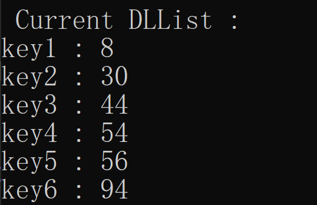

## 6 、修改Nachos源代码体验并发程序问题

### 6.1 并发操作链表

修改`threadtest.cc`文件，使其创建两个线程在并发环境下修改链表,在开头引入头文件`"dllist.h"`，里面包含对双向链表的定义以及对双向链表操作函数的声明，为了使两个线程能够并发操作链表，这里将双向链表定义为全局变量，两个线程共用一个内存空间，因此调用链表修改函数都是对同一个链表进行修改。

```c++
DLList *list = new DLList(); //定义链表为全局变量
```

为了便于选择线程测试样例，我们保留原先Nachos自带的`ThreadTest1()`线程测试函数，添加条件如果`testnum`的值为2时执行`ThreadTest2()`函数也就是当前对链表的线程并发操作测试。

```c++
void ThreadTest() {
    switch (testnum) {
    case 1:
	   ThreadTest1();break;
    case 2:
        ThreadTest2();break;
    default:
	   printf("No test specified.\n");break;
    }
}
```

在`ThreadTest2()`函数中，我们创建两个线程，两个线程执行的操作都是调用`DLListOperation`函数，该函数内部进行了一系列对于链表的操作：

```c++
void ThreadTest2()
{
    DEBUG('t', "Entering ThreadTest2");
    Thread *t = new Thread("forked thread");
    t->Fork(DLListOperation, 1);
    DLListOperation(0);
}
```

现在为了便于探索并发条件下的线程同步，接下来在`DLListOperation1`和`DLListOperation2`函数中定义各种链表操作并通过调用`currentThread->Yield()`切换当前线程由此来研究并发操作对链表最终结果的影响。

### 6.2 切换线程产生不同的操作链表结果

> 在开始讨论之前，首先说明在`InsertN`函数中虽然其中的`key`是随机数，但是由于调用的是`rand`函数，因此每次程序运行时生成的随机数都是相同的，属于伪随机数，为本次实验维持了不变量。在下面所有的`insertN`中，`DLListOperation1`中插入的数为12,32,32,52,54,`DLListOperation2`中插入的数为8,30,44,56,94。

#### **情况一：删除元素不符合预期**

`DLListOperation1`函数执行操作：

1. 调用`InsertN`函数插入5个元素
2. 切换线程
3. 调用`RemoveN`函数从链表首部移除4个元素

`DLListOperation2`函数执行操作：

   1. 调用`InsertN`函数插入5个元素

代码如下：

```c++
void DLListOperation1(int which){
    //case 1
    InsertN(5,list,1);
    currentThread->Yield();
    RemoveN(4,list);
}
void DLListOperation2(int which){
    //case 1
    InsertN(5,list,2);
}
```

在没有切换线程的情况下，链表最终的key排列为：



切换线程后链表最终的key排列为：


这是由于在未切换线程前程序的执行是先插入5个元素，马上移除前四个元素，剩下的一个元素即为54，第二个线程再插入5个元素，即为8,30,44,56,94，最终表的key就为8,30,44,54,56,94，但是如果有切换线程，那就是在两个线程连续插入了十个元素，并最后删除了前四个元素，删除的是这十个数中最大的四个元素，和本来需要删除的第一次插入的5个数里面最大的四个数不一致，因此导致了最后链表的结果不相同。


#### **情况二：对空链表进行删除**

`DLListOperation1`函数执行操作:

1. 调用`InsertN`函数插入5个元素
2. 调用`RemoveN`函数从链表首部移除4个元素
3. 线程切换
4. 调用`InsertN`函数插入5个元素

`DLListOperation2`函数执行操作：

      1. 调用`RemoveN`函数从链表首部移除4个元素

代码如下：

```c++
void DLListOperation1(int which){
    //case2
    InsertN(5,list,1);
    RemoveN(4,list);
    currentThread->Yield();
    InsertN(5,list,2);
}
void DLListOperation2(int which){
    //case2
    RemoveN(4,list);
}
```

在没有切换线程的情况下，链表最终的key排列为：


切换线程后链表最终的key排列为：


在这种情况下，最后得到的链表长度都不同，首先在没有切换线程的情况下，在线程一中首先对链表插入5个元素，再删除前四个元素，再插入五个元素，紧接着在线程二中删除四个元素，不存在删除元素个数大于链表长度的情况，此时得到的最终结果如上图所示。但是如果在线程一第二次插入五个元素之前切换到线程二执行删除四个元素的操作，很显然现在链表长度为1，不足以删除4个元素，因此执行这条命令实际上只能删除一个元素也就是54，这也就是为什么线程切换后的双向链表长度会多出3，最后结果剩下的五个元素即为第二次插入的五个元素。


#### **情况三：无法找到指定关键字结点**

`DLListOperation1`函数执行操作：

1. 调用`InsertN`函数插入5个元素
2. 线程切换
3. 调用`SortedRemove`函数移除 key = 12 的元素

`DLListOperation2`函数执行操作：

1. 调用`Remove`函数移除列表中的第一个元素（key最小的元素）

代码如下：

```c++
void DLListOperation1(int which){
    //case3
    InsertN(5,list,1);
    currentThread->Yield();
    list->SortedRemove(12);
}
void DLListOperation2(int which){
    //case3
    list->Remove(keyPtr);
}
```

在没有切换线程的情况下，链表最终的key排列为：


切换线程后链表最终的key排列为：


在这种情况下，如果没有切换线程，那么按照正常执行顺序，首先线程一插入5个元素，分别为12,32,32,52,54，接着删除key=12的元素，执行完成后线程二删除位于表最前端的元素，此时最前端的元素为32，因此最后表的结果为32,52,54。如果中间发生了线程切换，那么在线程一插入了5个元素之后马上切换到线程二执行删除位于表最前端的元素，那么此时删除的元素就是12，那么就造成问题，当线程二执行完成后回到线程一继续执行`SortedRemove`函数想要移除key=12的元素但是发现该元素已经不在了，由于该元素不存在该指令就不会删除任何元素，因此最后的链表剩下的元素为32,32,52,54，比没有切换线程前多出了一个元素。


#### **情况四：插入元素的key大小不符合预期**

`DLListOperation1`函数执行操作：

1. 调用`InsertN`函数插入5个元素
2. 调用`Prepend`函数在链表首部插入元素
3. 线程切换
4. 调用`Prepend`函数在链表首部插入元素

`DLListOperation2`函数执行操作：

1. 调用`Remove`函数移除列表中的第一个元素（key最小的元素）

代码如下：

```c++
void DLListOperation1(int which){
    //case4
    InsertN(5,list,1);
    currentThread->Yield();
    list->Prepend((void*)0);
    list->Prepend((void*)0);
}
void DLListOperation2(int which){
    //case4
    list->Remove(keyPtr);
}
```

在没有切换线程的情况下，链表最终的key排列为：


切换线程后链表最终的key排列为：


在这种情况下，会出错的原因是`Prepend`函数取的key应当为当前min_key的最小值减一,在`Prepend`前如果先执行`Remove`函数，那么最小值就被更新为了32，因此执行完线程二回到线程一再插入两个元素时，此时min_key的两个值就分别为30和31，与未切换线程情况下插入链表的key值不同，因此导致最后结果产生差异。


